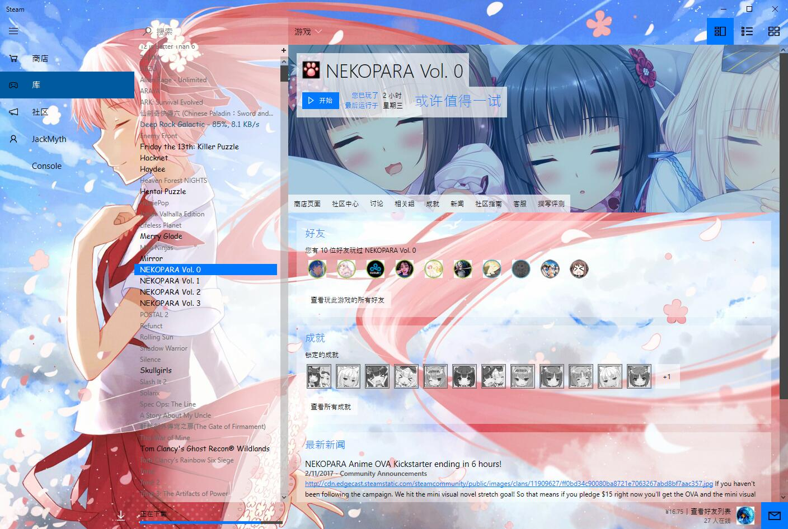
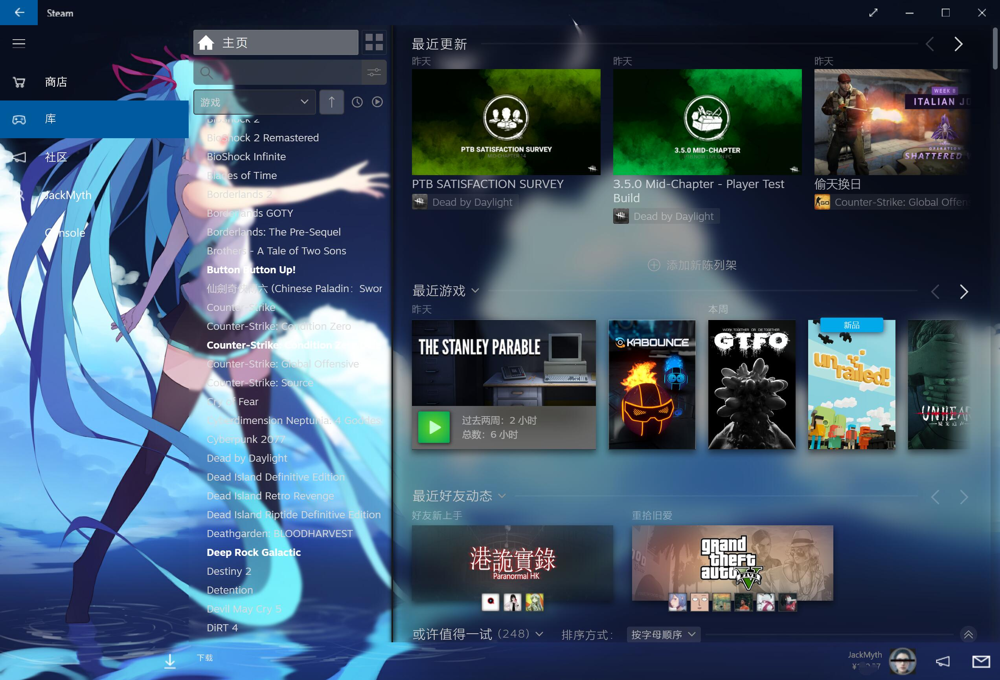
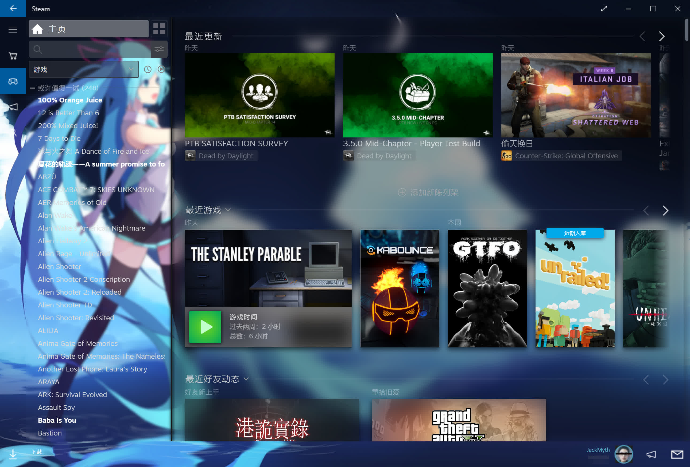

# Threshold Miku Skin for Steam
From [Threshold Skin](https://github.com/Edgarware/Threshold-Skin)  
Modified By JackMyth([Find me on Steam](https://steamcommunity.com/id/JackMyth/))  

Want a dark version? [Try this!](https://github.com/Jack-Myth/Threshold-Miku/tree/master)

## How to Install
 Download the skin,extract the zip file,then Run Install.cmd, it will automatically install to your steam.  
 Or  
 copy the folder to:
   * Windows - C:\Program Files (x86)\Steam\skins
   * Mac - /Users/\<username\>/Library/Application Support/Steam/Steam.AppBundle/Steam/Contents/MacOS/skins/
   * Linux - ~/.steam/skins

In Arch Linux(& Arch derivatives like Manjaro), you can use AUR packages [Dark](https://aur.archlinux.org/packages/threshold-miku-dark-steam-skin)/[Light](https://aur.archlinux.org/packages/threshold-miku-light-steam-skin)

## How to Use
1. In Steam, go to Settings > Interface > and choose Threshold Miku from the list of skins.
2. Restart Steam and enjoy!

# Introduce the Threshold Miku Light For SteamUI
  

# Collapsed Sidebar is also supported!  
  
Use "Threshold Miku Customizer" to apply this Style.   

# New Threshold Miku Customizer is included!  
[Source code here!](https://github.com/Jack-Myth/Threshold-Miku-Customizer-2)  
  
