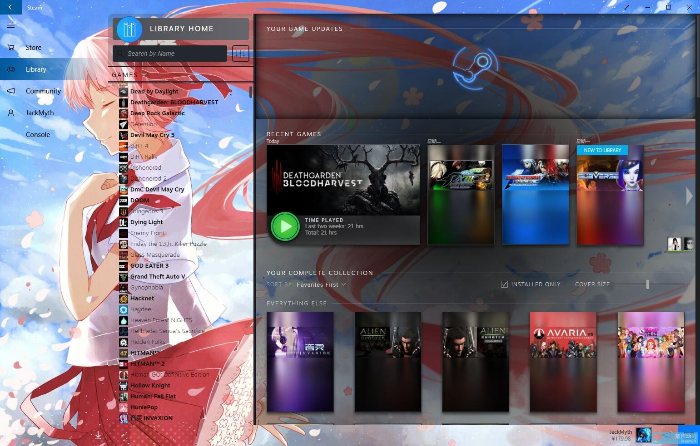

# Threshold Miku Skin for Steam
From [Threshold Skin](https://github.com/Edgarware/Threshold-Skin)  
Modified By JackMyth  

Want a dark version? [Try this!](https://github.com/Jack-Myth/Threshold-Miku/tree/master)

## Installation
1. Download the skin, extract the zip file, and copy the folder to:
   * Windows - C:\Program Files (x86)\Steam\skins
   * Mac - /Users/\<username\>/Library/Application Support/Steam/Steam.AppBundle/Steam/Contents/MacOS/skins/
   * Linux - ~/.steam/skins

2. In Steam, go to Settings > Interface > and choose Threshold Miku from the list of skins.

3. Restart Steam and enjoy!

# Introduce the Threshold Miku Light For SteamUI

It's an experimental version,and the SteamUI may have big changes in future,so if you meet any bugs,or have any advice,please post them on [the Issues Page](https://github.com/Jack-Myth/Threshold-Miku/issues)
# Installation
0. First I assuming you have already enabled the Steam New Library(SteamUI). If not, you can find the way to enable it at: [Reddit](https://www.reddit.com/r/Steam/comments/bymgzm/heres_how_you_get_the_new_steam_library_to_work/).
2. Make a folder named "skins" at Steam/steamui/
3. Download Threshold Miku Light at [the Releases Page](https://github.com/Jack-Myth/Threshold-Miku/releases), extract the folder to the folder we created at last step.
4. Open Steam/steaui/index.html,Add ***\<link href="skins/Threshold Miku/main.css" rel="stylesheet"\>*** before the "\</head\>"
5. Save the file, you will meet a new steam.
